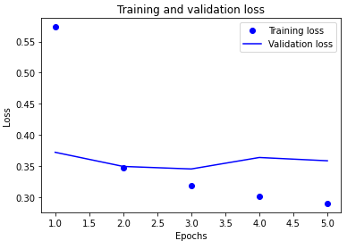
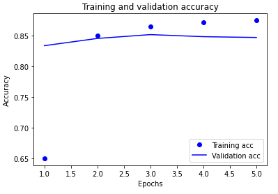
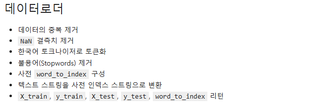
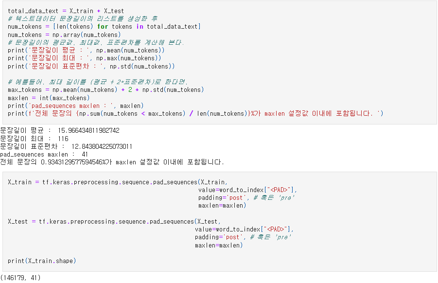
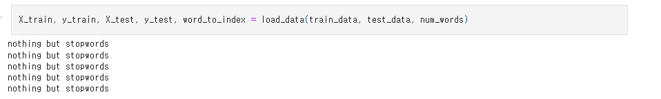
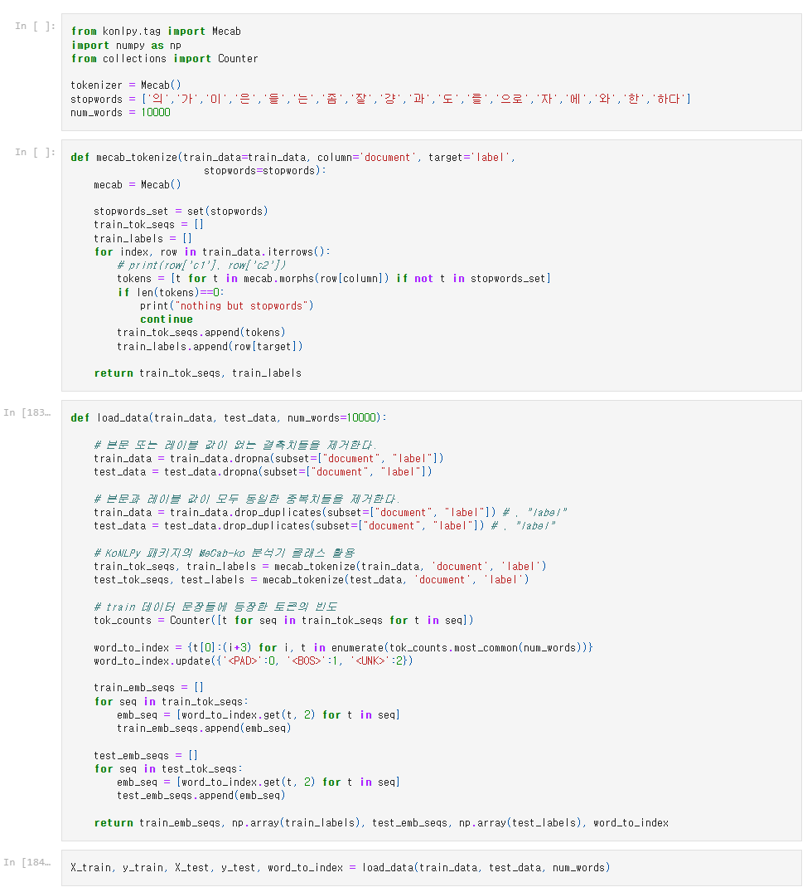

# AIFFEL Campus Online Code Peer Review Templete
- 코더 : 정우철
- 리뷰어 : 윤수영


# PRT(Peer Review Template)
- [O]  **1. 주어진 문제를 해결하는 완성된 코드가 제출되었나요?**
    - 문제에서 요구하는 최종 결과물이 첨부되었는지 확인
        - 중요! 해당 조건을 만족하는 부분을 캡쳐해 근거로 첨부
     
        - 아래와 같이 텍스트 모델을 학습하고 결과를 도출하였음


          


          
          
          
    
- [O]  **2. 전체 코드에서 가장 핵심적이거나 가장 복잡하고 이해하기 어려운 부분에 작성된 
주석 또는 doc string을 보고 해당 코드가 잘 이해되었나요?**
    - 해당 코드 블럭을 왜 핵심적이라고 생각하는지 확인
    - 해당 코드 블럭에 doc string/annotation이 달려 있는지 확인
    - 해당 코드의 기능, 존재 이유, 작동 원리 등을 기술했는지 확인
    - 주석을 보고 코드 이해가 잘 되었는지 확인
        - 중요! 잘 작성되었다고 생각되는 부분을 캡쳐해 근거로 첨부
     
        - 아래와 같이 진행사항을 목차화하여 중간중간 정리하였으며, 이를통해 학습에 도움이 됨
          
          
          
          
          
- [O]  **3. 에러가 난 부분을 디버깅하여 문제를 해결한 기록을 남겼거나
새로운 시도 또는 추가 실험을 수행해봤나요?**
    - 문제 원인 및 해결 과정을 잘 기록하였는지 확인
    - 프로젝트 평가 기준에 더해 추가적으로 수행한 나만의 시도, 
    실험이 기록되어 있는지 확인
        - 중요! 잘 작성되었다고 생각되는 부분을 캡쳐해 근거로 첨부
          
          
        - padding 부분에서 list in np.array out인 상황으로 model fit이 안된 에러가 있었는데 이를 해결하였으며, 해당사항을 코드와 함께 설명하였음
          
          
          
          
          
          
          
          
        
- [O]  **4. 회고를 잘 작성했나요?**
    - 주어진 문제를 해결하는 완성된 코드 내지 프로젝트 결과물에 대해
    배운점과 아쉬운점, 느낀점 등이 기록되어 있는지 확인
    - 전체 코드 실행 플로우를 그래프로 그려서 이해를 돕고 있는지 확인
        - 중요! 잘 작성되었다고 생각되는 부분을 캡쳐해 근거로 첨부
          
          
        - 코드에 다양한 시도를 적용하여 데이터의 특성, 코드의 처리과정을 모니터링하였으며, 해당사항을 코드 리뷰를 통해 설명하여 주었음
        - IMDB 영화 리뷰에서 사전 임베딩 데이터와 기본 모델간의 큰 차이가 있음 0.5 > 0.86
        - stopwords에서 제거된 단어로 인하여 0 길이가된 경우 출력하도록 하였으며, 총 5개 문장이 0가 되었음
        - 마침표가 가장 많이 나옴에도 불구하고 stopwords에서 마침표를 추가하여 제거하지 않은 이유 및 제거하고 진행할 계획
          
          
          
          
        
- [O]  **5. 코드가 간결하고 효율적인가요?**
    - 파이썬 스타일 가이드 (PEP8) 를 준수하였는지 확인
    - 코드 중복을 최소화하고 범용적으로 사용할 수 있도록 함수화/모듈화했는지 확인
        - 중요! 잘 작성되었다고 생각되는 부분을 캡쳐해 근거로 첨부
     
        - 아래와 같은 함수를 제작하여 코드를 단축시키고 간격하게 하며, 자동화를 통해 사용하기 용이하도록 하였음
          
          
          


# 회고(참고 링크 및 코드 개선)
```
# 리뷰어의 회고를 작성합니다.
# 코드 리뷰 시 참고한 링크가 있다면 링크와 간략한 설명을 첨부합니다.
# 코드 리뷰를 통해 개선한 코드가 있다면 코드와 간략한 설명을 첨부합니다.
```
- 코드 리뷰를 작성하며 함께 자신의 코드를 리뷰하였는데, 이를 통해 더 많은 내용을 인지하고, 각자 진행한 시행착오를 공유했다
- 코드 내부에 다양한 시도 및 코드 작성 구상을 남겨두어서 차후 다양한 실험이 가능할 것 같아, 매우 좋은 부분이라고 생각함
- tokenizer = Mecab() 토크나이저가 '더빙'을 '더'와 '빙'으로 토큰화합니다. 해당사항에 대하여 함께 고민하면 좋을 것 같습니다.
